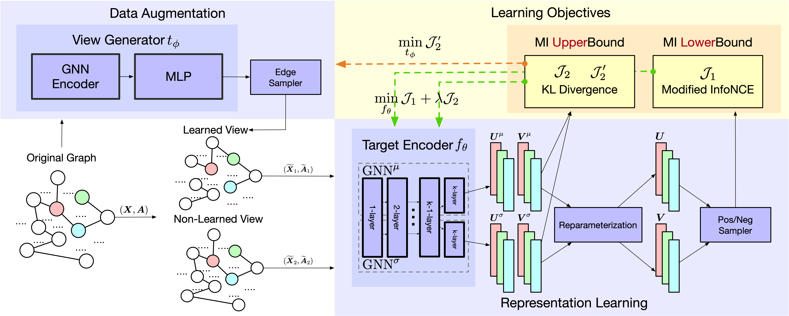

# Towards Generalizable Graph Contrastive Learning: An Information Theory Perspective

> Yige Yuan, Bingbing Xu, Huawei Shen, Qi Cao, Keting Cen, Wen Zheng, Xueqi Cheng
> 
> Neural Networks (NN), Volume 172, April 2024

This is an official PyTorch implementation of paper [Towards Generalizable Graph Contrastive Learning: An Information Theory Perspective](https://arxiv.org/abs/2211.10929).




## Requirements

To install requirements:

```setup
pip install -r requirements.txt
```

## Training & Evaluating

To train the model(s) in the paper, run this command:

```train
python -u train.py --dataset Cora  --if_save True  --save_path ./log
```
